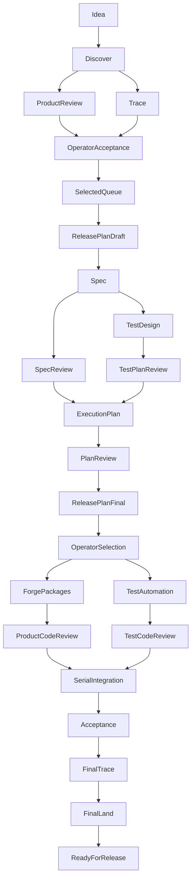

# Scenario-driven delivery

This document records the accepted target architecture. The first delivery adds Discovery, product architecture review, Trace, and an accepted-source handoff to Spec. Release planning, test-design workers, acceptance automation, concurrent implementation, and automatic release finalization are later deliveries, not capabilities of the existing delivery loop.

## Product contract

The operator starts with an idea in ordinary language. Discover develops the user goal, boundaries, scenarios, important errors, constraints, assumptions, and observable outcomes. A balanced Discovery is the default; material risk justifies deeper analysis. Blocking questions must be resolved before the operator accepts an exact content revision. Acceptance is not authorization to implement.

A feature has one permanent issue, created after a meaningful first draft when GitHub projection is authorized. Spec reuses it. Acceptance and selection for work are separate decisions. Selection comes from an operator-chosen queue; completed or already specified initiatives resume from verified evidence rather than entering Spec again.

An independent product reviewer compares the proposal with existing and planned capabilities. Relations include extends, depends-on, duplicates, alternative-to, conflicts-with, and replaces. Shared files alone do not establish a product conflict. The reviewer records evidence, options, and a recommendation. Discover records its position. Unresolved product alternatives go to the operator after one exchange rather than an agent consensus loop.

Decisions have stable IDs, alternatives, reasoning, provenance, and explicit supersession. Decisions remain in Git; cross-feature decisions may have a separate discussion issue. Sources from chat retain the relevant text and attributed confirmation without inventing a permanent URL or GitHub authorship.

Scenarios are Markdown documents. Requirements use EARS sentence patterns, not mandatory Gherkin. Test cases have concrete inputs and expected outcomes and link to scenario, requirement, and criterion IDs. A link alone does not prove coverage.

## Ownership and storage

| Artifact | Owner | Authority |
| --- | --- | --- |
| Discovery, source excerpts, product decisions | Discover | Git content and recorded operator decisions |
| Scenario behavior before handoff | Discover | Git scenario documents |
| Scenario behavior after handoff, requirements, design, tasks | Spec | Git; accepted changes retain IDs and lineage |
| Feature and task mappings | Discovery before handoff; Spec after handoff | Explicit verified mappings, one issue per feature |
| Work status and selected queue | Foreman projection | GitHub Issues / Projects |
| Product review | Independent product reviewer | Exact input revision and persisted findings |
| Roadmap and release composition | Release planner, future | Git; operator approves composition and order changes |
| Execution graph and estimates | Execution planner, future | Git plus measured run history |
| Test plan and cases | Test designer, future | Git, independently reviewed before implementation |
| Product code and technical tests | Forge | Reviewed commits |
| Acceptance automation | Test automation worker, future | Reviewed commits |
| Acceptance results and bugs | Acceptance, future | Immutable run evidence |
| Trace findings and generated views | Trace | Findings and revision-bound derived representations |
| Merge and closure | Land | Exact checked targets and applicable authority |
| Live assignments and recovery | Foreman | Local ignored runtime state, revalidated against durable evidence |

IDs are repository-wide for Discovery, scenarios, and decisions. Existing feature-local FR/AC/T IDs remain qualified by FEAT ID in cross-feature graphs. Derived graphs and HTML never override source artifacts. Runtime state is not a substitute for durable reports.

## Target workflow

Trace also runs at artifact gates and before closure. Every finding blocks its affected transition until independently resolved, including presentation defects. Other independent packages can continue. Findings identify an owner, reproduction or evidence, and a closure condition. Owners repair sources; Trace regenerates derived views. PR comments carry discussion around the exact revision; reports carry stable finding IDs. Standalone issues are reserved for independently tracked work, defects, and cross-feature decisions.

## Release planning and estimates

Release planning has two passes: after Discovery, then after specification and execution analysis. The planner always compares the full scope with a minimal useful first delivery. A release consists of independently valuable scenarios or inseparable scenario packages, including required errors and safeguards. The operator chooses the composition; agents cannot silently shrink it.

The roadmap describes outcomes, scenarios, dependencies, and preliminary estimates for later releases. Only the nearest release receives detailed design and execution planning. Dependencies that can change delivery order are investigated early.

Estimate actual agent and tool time, review/remediation cycles, resource constraints, and the critical path. Separate human/external waiting from execution. Calibrate on a representative scenario within the first selected delivery. Record harness/model, role, task type, elapsed time, retries, and outcomes. Mark estimates preliminary until measurements support them; do not convert human workdays using a speed multiplier.

Reforecast after calibration, package completion, blockers, requirement changes, or exceeding the forecast range. Updating a forecast requires no approval. Changing agreed scope or order requires an operator decision. Propose the number of simultaneous workers, including reviewers and Trace, with time/cost trade-offs.

## Parallel execution and integration

An execution planner consumes prior agents' artifacts and produces dependency and conflict graphs, preparation work, isolated workspaces, environment resources, integration order, and estimates. Independent Plan Review checks this plan. Foreman dispatches it; it does not invent the schedule or rewrite plans.

Each implementation package has its own branch/worktree and isolated ports, stores, queues, and fixtures. Land alone serializes integrations into the release branch. Branches refresh on relevant dependency changes and are checked against the current release branch before integration. A clean textual merge is not compatibility evidence. Conflicts return to the owning producer.

The current shared-checkout Herdr delivery backend remains serial until the concurrent writer adapter ships. Read-only snapshot reviews in the first delivery must not be presented as parallel implementation support.

## Test design and acceptance

An independent test designer receives a mandatory context pack: release value/scope, scenarios, EARS requirements, criteria, decisions, affected architecture and interfaces, environment profile, existing tests, bugs, and reports. Exact revisions and further references are included. Missing expected behavior returns to Spec.

Test-plan review is a separate independent assignment. A separate automation worker implements accepted cases; a separate Code Review assignment checks those tests. Forge owns technical tests. Acceptance executes automation and risk-based exploratory checks on the assembled version. A passing assertion must distinguish correct behavior from plausible defects.

The first acceptance environment is a local build. Local substitutes support repeatability; mandatory real test integrations are identified during design. Missing access blocks the relevant acceptance, not unrelated tests. Unstable tests retain the failure and retry result; passing a retry does not clear a finding. Diagnose product, test, or environment ownership and repair the cause.

After fixes, rerun the reproducer and affected scenarios. The final build runs the full agreed acceptance and regression set. Repeat exploration in affected areas. Every mandatory check and finding must be resolved before finalization.

Reports identify release version, build/commit, scenario and test-plan revisions, environment, data, run ID, time, counts, unique scenario outcomes, retries, gaps, defects, and decision. Keep accepted, implemented, and released distinct. Confirmed bugs are created automatically under configured publication authority, deduplicated, and linked to evidence. Severity reflects evidenced impact, affected scope, workaround, reproducibility, and reversibility: S1 data/access/outage, S2 core flow blocked without workaround, S3 limited or workaround, S4 cosmetic. Priority and release blocking are separate; issue creation does not authorize implementation.

Structured manifests/results remain in Git. HTML and heavy evidence are checksummed archives attached to a reporting Release. Historical runs are not rewritten. Publishing reporting evidence does not release the product. Remove secrets and sensitive fixtures before publication.

Final merging is automatic only under the configured target-bound policy and current successful checks. Default completion is ready for release. Product publication/deployment remains outside the pipeline until environments and rollout/recovery rules are configured and explicitly enabled.

## Implementation deliveries

1. Discovery to Spec with product review, exact acceptance, permanent issue reuse, EARS, minimal Trace, Mermaid, and HTML. Verify interruption, resumption, changed decisions, stale findings, and duplicate prevention.
2. Release/execution planning, roadmap, Projects views, and measured forecasting.
3. Test design, automation, local acceptance, bugs, and persistent report publication.
4. Isolated parallel implementation through Herdr and serialized release integration.
5. Automatic finalization, version preparation, and recovery from partially completed external operations.

Future paths, new worker configuration keys, quick-route bypass rules, repeated-failure thresholds, and hosted HTML publishing are not implicitly enabled by this design. Each delivery must declare migrations and observable acceptance tests before shipping.
